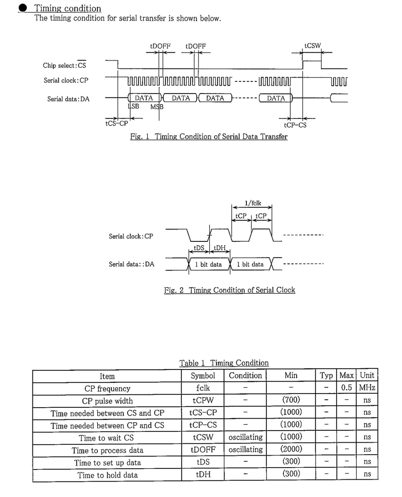

## 时序

1. cs低电平触发。
2. 时钟频率，最大0.5MHz，设置0.4MHz时钟频率。T= 2500ns

3. 需关注cs提前开启时间、cs延迟关断时间
   * cs 提前1周期开启，延迟1周期关断
4. 数据格式：
   * LSB在前，MSB在后，在idf中默认MSB在前，配置`SPI_DEVICE_BIT_LSBFIRST`于`spi_device_interface_config_t`
   * 数据间隔最小2000ns，中间隔一周波。

** 实际测试不加延迟也可 **